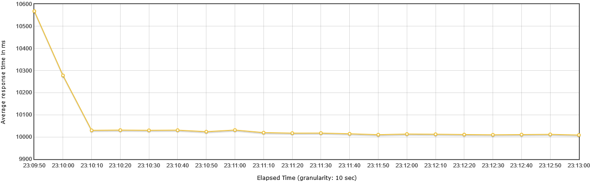

### **PERF-WEBFLUX**
**spring boot web + spring boot webflux**

#### 1. Run postgres
/docker
```bash
docker-compose up -d
```

#### 2. Measure webmvc
```bash
run webmvc application
curl -w "total: %{time_total}" -o /dev/null -s "localhost:8080/movies"
```
or 
```bash
run test: WebmvcApplicationTest
```

#### 3. Measure webflux
```bash
run webflux application
curl -w "total: %{time_total}" -o /dev/null -s "localhost:8080/movies"
```
or 
```bash
run test: WebfluxApplicationTest
```

#### 4. Performance test
run jmeter
**Test 1 (all movies/5 user)**
```bash
(Test Plan) add -> threads -> thread group
Number of Threads (users): 5
Ramp-up periods (seconds): 1
Loop Count: 5
(Thread Group) add -> Sampler -> Http request
Server Name or IP: localhost
Port Number: 8080
Http Request: GET
Path: /movies
(Thread Group) add -> Listener -> View Results in Table
```
```bash
Result for Webflux:
Average response time: 22.287s
```

```bash
Result for Webmvc:
Average response time: 8.740s
```

**Test 2 (all movies/10 user)**
```bash
(Test Plan) add -> threads -> thread group
Number of Threads (users): 10
Ramp-up periods (seconds): 1
Loop Count: 5
(Thread Group) add -> Sampler -> Http request
Server Name or IP: localhost
Port Number: 8080
Http Request: GET
Path: /movies
(Thread Group) add -> Listener -> View Results in Table
```
```bash
Result for Webflux:
Average response time: 37.767s
```

```bash
Result for Webmvc:
Average response time: 18.762s
```

**Test 3 (single movie/200 user)**
```bash
(Test Plan) add -> threads -> thread group
Number of Threads (users): 200
Ramp-up periods (seconds): 1
Loop Count: 5
(Thread Group) add -> Sampler -> Http request
Server Name or IP: localhost
Port Number: 8080
Http Request: GET
Path: /movies/id
(Thread Group) add -> Listener -> View Results in Table
```
```bash
Result for Webflux:
Average response time: 0.809s
```

```bash
Result for Webmvc:
Average response time: 0.463
```

**Test 4 (single movie/400 user)**
```bash
(Test Plan) add -> threads -> thread group
Number of Threads (users): 400
Ramp-up periods (seconds): 1
Loop Count: 5
(Thread Group) add -> Sampler -> Http request
Server Name or IP: localhost
Port Number: 8080
Http Request: GET
Path: /movies/id
(Thread Group) add -> Listener -> View Results in Table
```
```bash
Result for Webflux:
Average response time: 1.206s
```

```bash
Result for Webmvc:
Average response time: 0.733
```

**Test 5 (mock/500 user)**
Response time mock: 10s
```bash
(Test Plan) add -> threads -> thread group
Number of Threads (users): 500
Ramp-up periods (seconds): 1
Loop Count: infinite
(Thread Group) add -> Sampler -> Http request
Server Name or IP: localhost
Port Number: 8080
Http Request: GET
Path: /movies/mock
(Thread Group) add -> Listener -> Response Time Graph
```
```bash
Result for Webflux:
Average response time: 10s
```

```bash
Result for Webmvc:
Average response time: 22s
```
